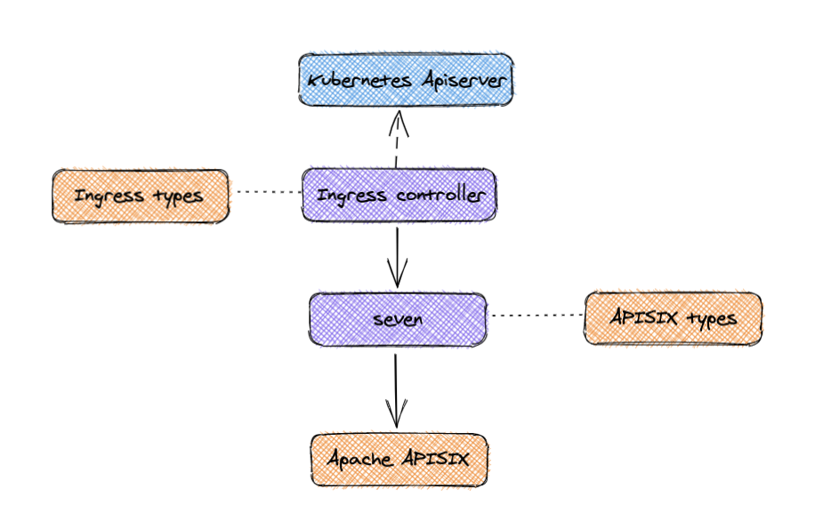

<!--
#
# Licensed to the Apache Software Foundation (ASF) under one or more
# contributor license agreements.  See the NOTICE file distributed with
# this work for additional information regarding copyright ownership.
# The ASF licenses this file to You under the Apache License, Version 2.0
# (the "License"); you may not use this file except in compliance with
# the License.  You may obtain a copy of the License at
#
#     http://www.apache.org/licenses/LICENSE-2.0
#
# Unless required by applicable law or agreed to in writing, software
# distributed under the License is distributed on an "AS IS" BASIS,
# WITHOUT WARRANTIES OR CONDITIONS OF ANY KIND, either express or implied.
# See the License for the specific language governing permissions and
# limitations under the License.
#
-->

# Apache APISIX for Kubernetes

Use [Apache APISIX](https://github.com/apache/apisix#apache-apisix) for Kubernetes [Ingress](https://kubernetes.io/docs/concepts/services-networking/ingress/).

All configurations in `apisix-ingress-controller` are defined with Kubernetes CRDs (Custom Resource Definitions). Such as configure [plugins](https://github.com/apache/apisix/tree/master/doc/plugins), Support service registration discovery mechanism for upstreams, load balancing and more in Apache APISIX.

`apisix-ingress-controller` is an Apache APISIX control plane component. Currently it serves for Kubernetes clusters. In the future, we plan to separate the submodule to adapt to more deployment modes, such as virtual machine clusters.

The technical architecture of `apisix-ingress-controller`:

## Status

This project is currently considered experimental.

## Features

* Declarative configuration for Apache APISIX with Custom Resource Definitions(CRDs), using k8s yaml struct with minimum learning curve.
* Hot-reload during yaml apply.
* Native Kubernetes Ingress (both `v1` and `v1beta1`) support.
* Auto register k8s endpoint to upstream(Apache APISIX) node.
* Out of box support for node health check.
* Support load balancing based on pod (upstream nodes).
* Plug-in extension supports hot configuration and immediate effect.
* Ingress controller itself as a pluggable hot-reload component.
* Multi-cluster configuration distribution.

## Modules

### 1. `Ingress types` Submodule

- Define the CRD(CustomResourceDefinition) needed by Apache APISIX

- Currently supports ApisixRoute/ApisixUpstream，and other service and route level plugins.

- Can be packaged as a stand-alone binary, keep in sync with the ingress definition.

- [CRD design](https://github.com/apache/apisix-ingress-controller/issues/3)

### 2. `APISIX types` Submodule

- Define interface objects to match concepts from Apache APISIX like route, service, upstream, and plugin.

- Can be a packaged as a stand-alone binary, need to match with compatible Apache APISIX version.

- Add new types to this module to support new features.

### 3. `Seven` submodule

- Contain main application logic.

- Sync the k8s cluster states to Apache APISIX, based on Apisix-types object.

### 4.`Ingress-controller` Submodule

- Driver process for ingress controller, watches k8s apiserver.

- Match and covert Apisix-ingress-types to Apisix-types before handing the control over to the above module `seven`.

Get more [implementation details](./docs/design.md).

## Get started

* [How to install](./docs/install.md)

## Todos

* Support UDP definition. [#116](https://github.com/apache/apisix-ingress-controller/issues/116)
* Support TCP definition. [#115](https://github.com/apache/apisix-ingress-controller/issues/115)
* Support GRPC definition. [#114](https://github.com/apache/apisix-ingress-controller/issues/114)
* Add a complete demo. [#9](https://github.com/apache/apisix-ingress-controller/issues/9)
* More todos will display in [issues](https://github.com/apache/apisix-ingress-controller/issues)

## Documents

* [Usage](./docs/usage.md)
* [SDK doc](./docs/develop.md)
* [Design introduction](./docs/design.md)

## FAQ

* [FAQ](./docs/FAQ.md)

## User stories

- [aispeech: Why we create a new k8s ingress controller?(Chinese)](https://mp.weixin.qq.com/s/bmm2ibk2V7-XYneLo9XAPQ)
- [Tencent Cloud: Why choose Apache APISIX to implement the k8s ingress controller?(Chinese)](https://www.upyun.com/opentalk/448.html)

## Contributing

We welcome all kinds of contributions from the open-source community, individuals and partners.

* [Contributing Guide](./docs/contribute.md)

## Community

* Mailing List: Mail to dev-subscribe@apisix.apache.org, follow the reply to subscribe the mailing list.
* QQ Group - 578997126
*  - follow and interact with us using hashtag `#ApacheAPISIX`
* [Bilibili video](https://space.bilibili.com/551921247)

## Milestone

* [Milestone](https://github.com/apache/apisix-ingress-controller/milestones)

## Terminology

* Ingress APISIX: the whole service that contains the proxy ([Apache APISIX](https://apisix.apache.org)) and ingress controller (apisix ingress controller).
* apisix-ingress-controller: the ingress controller component.

## License

[Apache License 2.0](https://github.com/apache/apisix-ingress-controller/blob/master/LICENSE)
