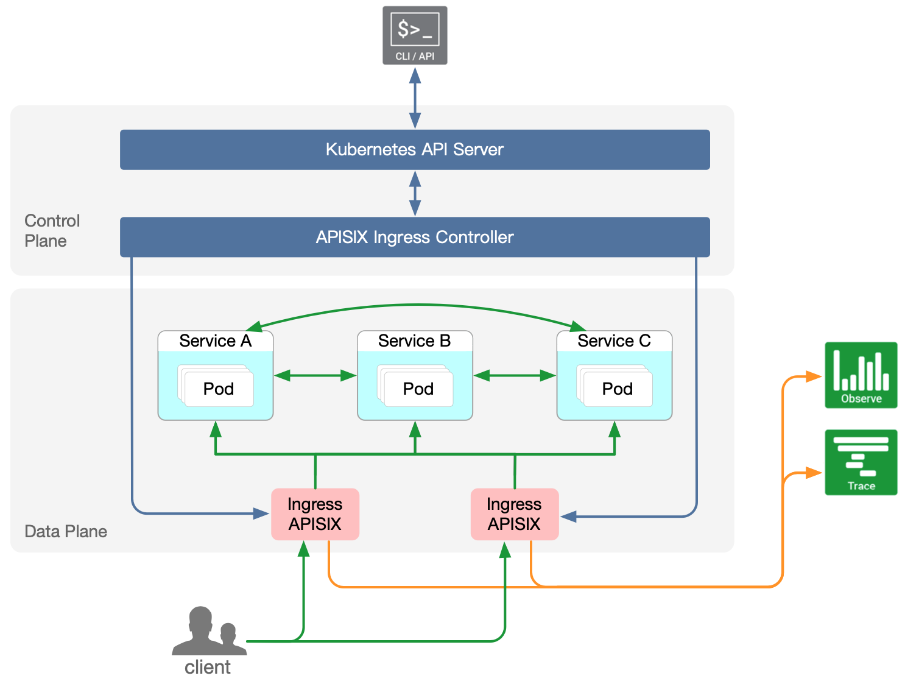
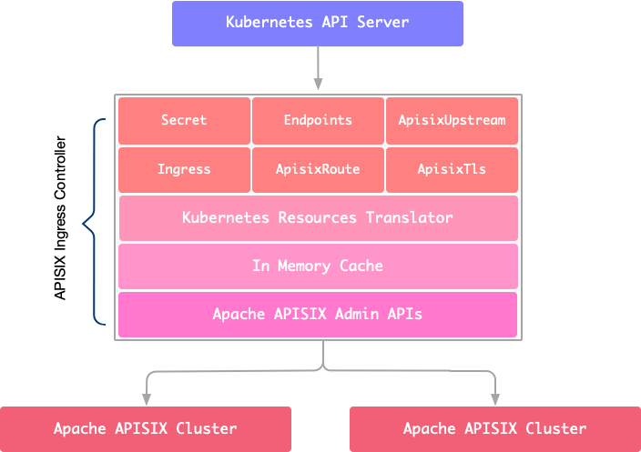

<!--
#
# Licensed to the Apache Software Foundation (ASF) under one or more
# contributor license agreements.  See the NOTICE file distributed with
# this work for additional information regarding copyright ownership.
# The ASF licenses this file to You under the Apache License, Version 2.0
# (the "License"); you may not use this file except in compliance with
# the License.  You may obtain a copy of the License at
#
#     http://www.apache.org/licenses/LICENSE-2.0
#
# Unless required by applicable law or agreed to in writing, software
# distributed under the License is distributed on an "AS IS" BASIS,
# WITHOUT WARRANTIES OR CONDITIONS OF ANY KIND, either express or implied.
# See the License for the specific language governing permissions and
# limitations under the License.
#
-->

# Apache APISIX for Kubernetes

Use [Apache APISIX](https://github.com/apache/apisix#apache-apisix) for Kubernetes [Ingress](https://kubernetes.io/docs/concepts/services-networking/ingress/).

All configurations in `apisix-ingress-controller` are defined with Kubernetes CRDs (Custom Resource Definitions). Such as configure [plugins](https://github.com/apache/apisix/blob/master/docs/en/latest/plugins.md), Support service registration discovery mechanism for upstreams, load balancing and more in Apache APISIX.

`apisix-ingress-controller` is an Apache APISIX control plane component. Currently it serves for Kubernetes clusters. In the future, we plan to separate the submodule to adapt to more deployment modes, such as virtual machine clusters.

The technical architecture of `apisix-ingress-controller`:

## Status

This project is currently general availability.

## Features

* Declarative configuration for Apache APISIX with Custom Resource Definitions(CRDs), using k8s yaml struct with minimum learning curve.
* Hot-reload during yaml apply.
* Native Kubernetes Ingress (both `v1` and `v1beta1`) support.
* Auto register k8s endpoint to upstream (Apache APISIX) node.
* Support load balancing based on pod (upstream nodes).
* Out of box support for node health check.
* Plug-in extension supports hot configuration and immediate effect.
* Support SSL and mTLS for routes.
* Support traffic split and canary deployments.
* Support TCP 4 layer proxy.
* Ingress controller itself as a pluggable hot-reload component.
* Multi-cluster configuration distribution.

[More about comparison among multiple Ingress Controllers.](https://docs.google.com/spreadsheets/d/191WWNpjJ2za6-nbG4ZoUMXMpUK8KlCIosvQB0f-oq3k/edit?ts=5fd6c769#gid=907731238)

## Internal Architecture

## Prerequisites

Apisix ingress controller requires Kubernetes version 1.15+.

## Apache APISIX Ingress vs. Kubernetes Ingress Nginx

* Hot-reload during yaml apply.
* [More convenient canary deployment.](./docs/assets/en/latest/concepts/apisix_route.md)
* Verify the correctness of the configuration, safe and reliable.
* [Rich plugins and ecology.](https://github.com/apache/apisix/tree/master/docs/en/latest/plugins)
* Supports APISIX custom resources and Kubernetes native Ingress resources.
* More active community

## Contributor over time

## Get started

* [How to install](./install.md)

## Todos

* Support UDP definition. [#116](https://github.com/apache/apisix-ingress-controller/issues/116)
* Support GRPC definition. [#114](https://github.com/apache/apisix-ingress-controller/issues/114)
* Add a complete demo. [#9](https://github.com/apache/apisix-ingress-controller/issues/9)
* More todos will display in [issues](https://github.com/apache/apisix-ingress-controller/issues)

## Documents

* [Get Started](./docs/en/latest/getting-started.md)
* [SDK doc](./docs/en/latest/development.md)
* [Design introduction](./docs/en/latest/design.md)

## FAQ

* [FAQ](./docs/en/latest/FAQ.md)

## User stories

- [aispeech: Why we create a new k8s ingress controller?(Chinese)](https://mp.weixin.qq.com/s/bmm2ibk2V7-XYneLo9XAPQ)
- [Tencent Cloud: Why choose Apache APISIX to implement the k8s ingress controller?(Chinese)](https://www.upyun.com/opentalk/448.html)

## Contributing

We welcome all kinds of contributions from the open-source community, individuals and partners.

* [Contributing Guide](./docs/en/latest/contribute.md)

## Community

* Mailing List: Mail to dev-subscribe@apisix.apache.org, follow the reply to subscribe the mailing list.
* QQ Group - 578997126
*  - follow and interact with us using hashtag `#ApacheAPISIX`
* [Bilibili video](https://space.bilibili.com/551921247)

## Milestone

* [Milestone](https://github.com/apache/apisix-ingress-controller/milestones)

## Terminology

* Ingress APISIX: the whole service that contains the proxy ([Apache APISIX](https://apisix.apache.org)) and ingress controller (apisix ingress controller).
* apisix-ingress-controller: the ingress controller component.

## License

[Apache License 2.0](https://github.com/apache/apisix-ingress-controller/blob/master/LICENSE)
