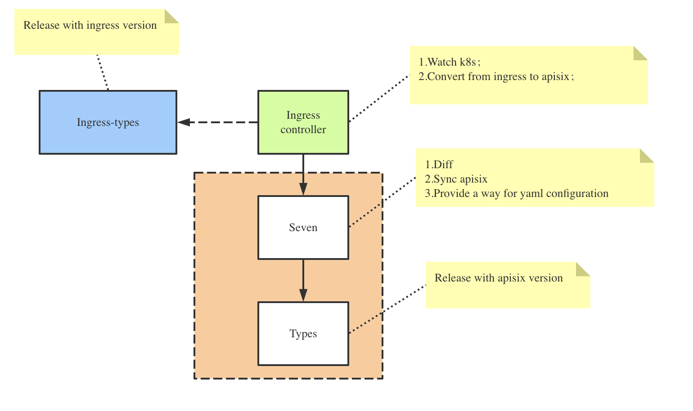

# ingress-controller

Apache APISIX ingress for Kubernetes.

## Design

### 1.Ingress-types

- defines the CRD(CustomResourceDefinition) needed by Apache APISIX

- currently supports ApisixRoute/ApisixService/ApisixUpstream，and other service and route level plugins;

- can be packaged as a stand-alone binary, keep in sync with the ingress definition;

- [CRD design](https://github.com/api7/ingress-controller/issues/3)

### 2.Types

- define interface objects to match concepts from Apache APISIX like route, service, upstream, and plugin;

- can be a packaged as a stand-alone binary, need to match with compatible Apache APISIX version;

- add new types to this module to support new features;

### 3.Seven

- contains main application logic;

- Sync the k8s cluster states to Apache APISIX, based on Apisix-types object;

### 4.Ingress-controller

- driver process for ingress controller; watches k8s apiserver;

- match and covert Apisix-ingress-types to Apisix-types before handing the control over to the above module seven;

## Sequence Diagram

