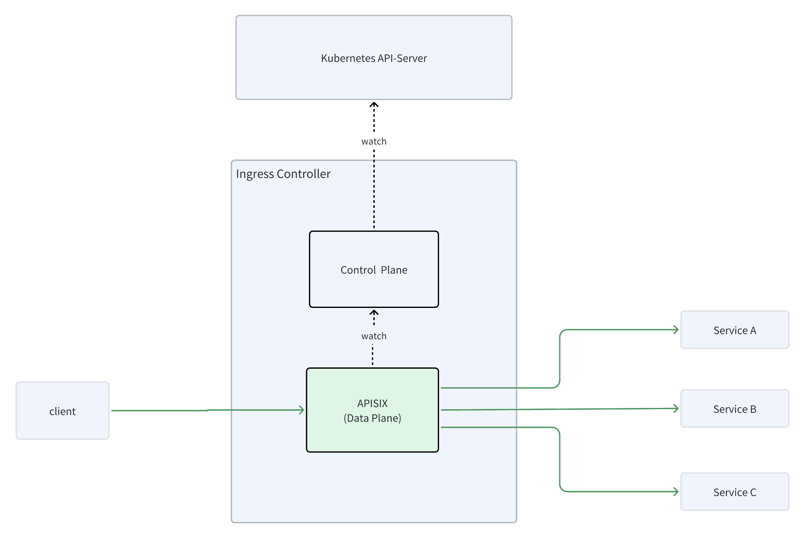
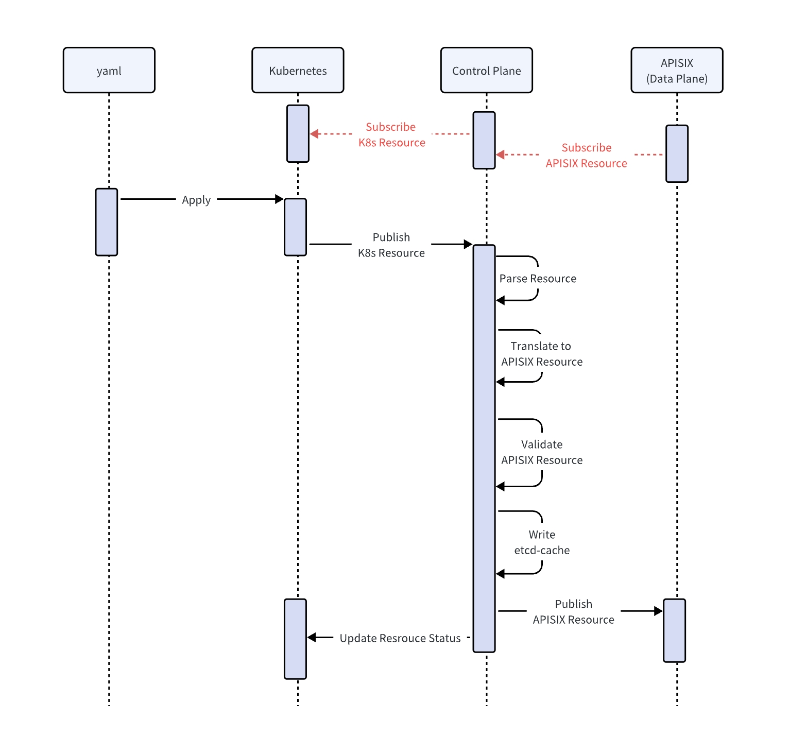

<!--
#
# Licensed to the Apache Software Foundation (ASF) under one or more
# contributor license agreements.  See the NOTICE file distributed with
# this work for additional information regarding copyright ownership.
# The ASF licenses this file to You under the Apache License, Version 2.0
# (the "License"); you may not use this file except in compliance with
# the License.  You may obtain a copy of the License at
#
#     http://www.apache.org/licenses/LICENSE-2.0
#
# Unless required by applicable law or agreed to in writing, software
# distributed under the License is distributed on an "AS IS" BASIS,
# WITHOUT WARRANTIES OR CONDITIONS OF ANY KIND, either express or implied.
# See the License for the specific language governing permissions and
# limitations under the License.
#
-->

:::note

**This feature is experimental**

:::

## Background

The new architecture has the following features:

1. Reduce maintenance costs without the need for additional maintenance of a complete APISIX cluster and (etcd cluster).
2. Deployment is simpler and easier to use

## Design

In the new architecture, the control-plane will simulate the ETCD configuration center to publish data.
The data-plane APISIX will subscribe to data from the control-plane.

### Cache (etcd-server-mock)

Since apisix strongly relies on the etcd API, the control-plane will simulate the etcd service publishing data to APISIX.

### Architecture



### Timing diagram



## Installation

Save the APISIX Ingress version to an environment variable to be used next:

```bash
APISIX_INGRESS_VERSION="1.7.0"
```

Clone the APISIX Ingress source code of this version into a new directory apisix-APISIX_VERSION:

```bash
git clone --depth 1 --branch ${APISIX_INGRESS_VERSION} https://github.com/apache/apisix-ingress-controller.git ingress-apisix-${APISIX_INGRESS_VERSION}
```

Install the CRDs and ingress-apisix:

```bash
cd ingress-apisix-${APISIX_INGRESS_VERSION}
# install CRDs
kubectl apply -k samples/deploy/crd/v1
# install ingress-apisix
kubectl apply -f samples/deploy/composite.yaml
```

```shell
# install ingress-apisix output
namespace/ingress-apisix created
clusterrole.rbac.authorization.k8s.io/apisix-view-clusterrole created
serviceaccount/apisix-view-serviceaccount created
clusterrolebinding.rbac.authorization.k8s.io/apisix-view-clusterrolebinding created
configmap/apisix-gw-config.yaml created
deployment.apps/ingress-apisix-composite-deployment created
service/ingress-apisix-gateway created
```

Check the pod status to confirm successful installation:

```shell
kubectl get service -n ingress-apisix # check service
kubectl get pods -n ingress-apisix # check pod
```

```shell
# service
NAME                        TYPE        CLUSTER-IP       EXTERNAL-IP   PORT(S)                      AGE
ingress-apisix-gateway      NodePort    10.99.236.58     <none>        80:31143/TCP,443:30166/TCP   90s
# pod
NAME                                                 READY   STATUS    RESTARTS   AGE
ingress-apisix-composite-deployment-5df9bc99c7-xxpvq   2/2     Running   0          100s
```

## example

Install the ApisixRoute and httpbin app:

```shell
kubectl apply -f samples/httpbin/httpbin-route.yaml
```

After forwarding the local port 9080 to the `ingress-apisix-gateway` service port 80, send a request:

```bash
# forward local port 9080 to ingress-apisix-gateway service port 80
kubectl port-forward service/ingress-apisix-gateway 9080:80 -n ingress-apisix &
# send a request
curl http://127.0.0.1:9080/headers -H 'Host: httpbin.org'
```

```shell
{
  "headers": {
    "Accept": "*/*", 
    "Host": "httpbin.org", 
    "User-Agent": "curl/7.74.0", 
    "X-Forwarded-Host": "httpbin.org"
  }
}
```
