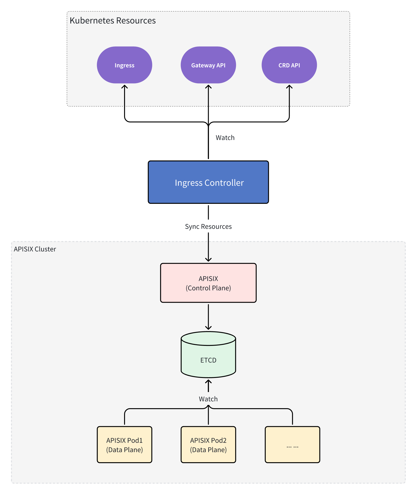
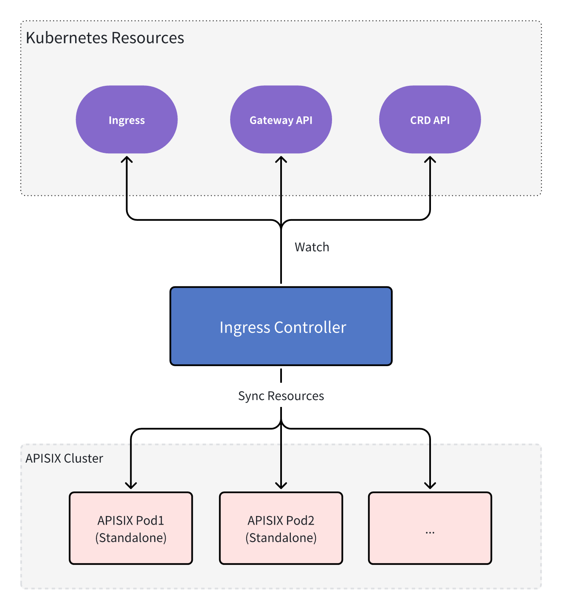

<!--
#
# Licensed to the Apache Software Foundation (ASF) under one or more
# contributor license agreements.  See the NOTICE file distributed with
# this work for additional information regarding copyright ownership.
# The ASF licenses this file to You under the Apache License, Version 2.0
# (the "License"); you may not use this file except in compliance with
# the License.  You may obtain a copy of the License at
#
#     http://www.apache.org/licenses/LICENSE-2.0
#
# Unless required by applicable law or agreed to in writing, software
# distributed under the License is distributed on an "AS IS" BASIS,
# WITHOUT WARRANTIES OR CONDITIONS OF ANY KIND, either express or implied.
# See the License for the specific language governing permissions and
# limitations under the License.
#
-->

The APISIX Ingress Controller is used to manage the APISIX Gateway as either a standalone application or a Kubernetes-based application. It dynamically configures and manages the APISIX Gateway using Gateway API resources.

## Admin API Mode

In the traditional deployment approach, APISIX uses etcd as its configuration center, allowing administrators to dynamically manage routes, upstreams, and other resources through RESTful APIs. It supports distributed cluster deployments with real-time configuration synchronization.

## Standalone Mode (Experimental)

APISIX runs independently without relying on etcd, supporting two sub-modes - file-driven (managing configuration through conf/apisix.yaml files) and API-driven (storing configuration in memory with full configuration management through the dedicated /apisix/admin/configs endpoint).

This mode is particularly suitable for Kubernetes environments and single-node deployments, where the API-driven memory management approach combines the convenience of traditional Admin API with the simplicity of Standalone mode.

