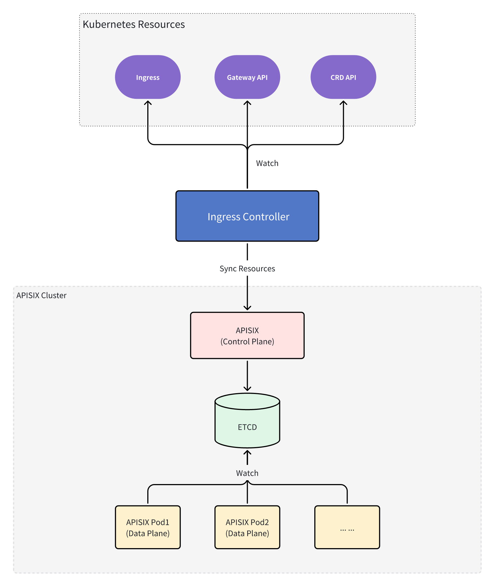
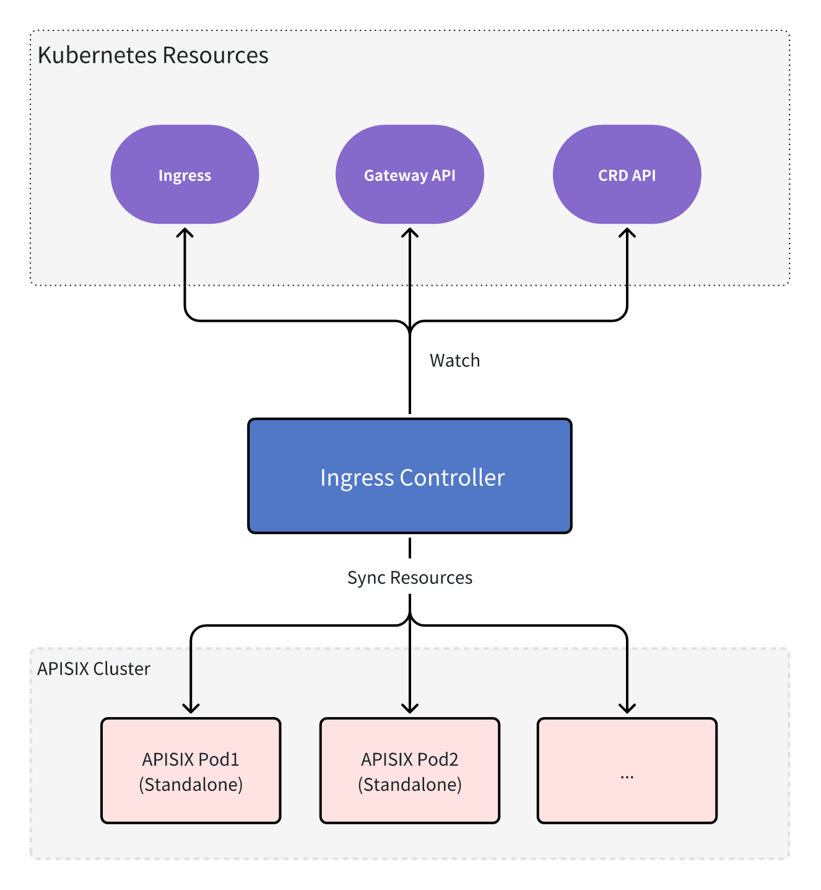

<!--
#
# Licensed to the Apache Software Foundation (ASF) under one or more
# contributor license agreements.  See the NOTICE file distributed with
# this work for additional information regarding copyright ownership.
# The ASF licenses this file to You under the Apache License, Version 2.0
# (the "License"); you may not use this file except in compliance with
# the License.  You may obtain a copy of the License at
#
#     http://www.apache.org/licenses/LICENSE-2.0
#
# Unless required by applicable law or agreed to in writing, software
# distributed under the License is distributed on an "AS IS" BASIS,
# WITHOUT WARRANTIES OR CONDITIONS OF ANY KIND, either express or implied.
# See the License for the specific language governing permissions and
# limitations under the License.
#
-->

APISIX Ingress Controller watches Kubernetes Ingress, Gateway API, and APISIX custom resources, translates their desired state into Apache APISIX configuration, and keeps the gateway configuration synchronized. APISIX remains the data plane that receives and proxies traffic.

The controller can deliver configuration to APISIX through Admin API mode or Standalone API-driven mode. See [APISIX Ingress Controller Resources](./resources.md) for the Kubernetes resources the controller watches and [Configure Routes](../getting-started/configure-routes.md) for a working routing example.

## Admin API Mode

In Admin API mode, APISIX uses etcd as its configuration center. APISIX Ingress Controller sends translated routes, upstreams, and other resources to the APISIX Admin API, and APISIX stores the configuration in etcd. This mode supports distributed APISIX clusters with dynamic configuration synchronization.

## Standalone Mode (Experimental)

APISIX Standalone mode does not require etcd. It supports file-driven configuration through `conf/apisix.yaml` and API-driven configuration stored in memory through the `/apisix/admin/configs` endpoint.

APISIX Ingress Controller uses the API-driven variant to publish the complete configuration to APISIX. This mode reduces external dependencies in Kubernetes and single-node deployments, but it is currently experimental.

Configure the control plane mode, endpoint or Service, TLS verification, and authentication with `GatewayProxy`. See [Configure CP Endpoint and Admin Key](../reference/example.md#configure-cp-endpoint-and-admin-key) for an example and the [ControlPlaneProvider API reference](../reference/api-reference.md#controlplaneprovider) for all available fields.
