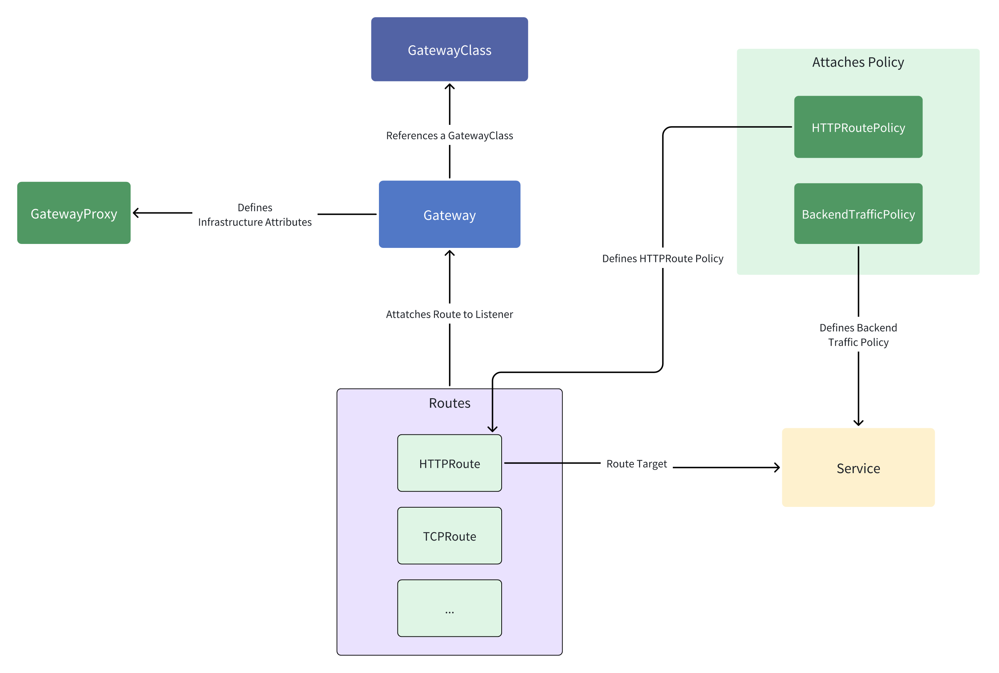
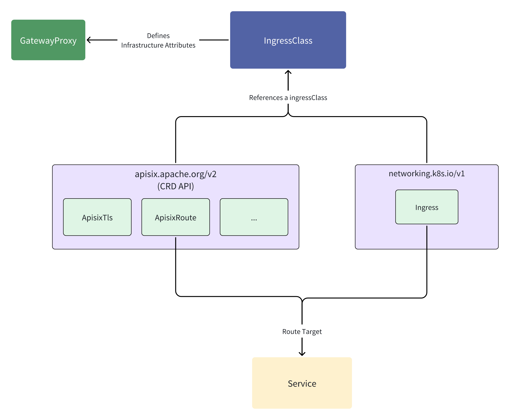

<!--
#
# Licensed to the Apache Software Foundation (ASF) under one or more
# contributor license agreements.  See the NOTICE file distributed with
# this work for additional information regarding copyright ownership.
# The ASF licenses this file to You under the Apache License, Version 2.0
# (the "License"); you may not use this file except in compliance with
# the License.  You may obtain a copy of the License at
#
#     http://www.apache.org/licenses/LICENSE-2.0
#
# Unless required by applicable law or agreed to in writing, software
# distributed under the License is distributed on an "AS IS" BASIS,
# WITHOUT WARRANTIES OR CONDITIONS OF ANY KIND, either express or implied.
# See the License for the specific language governing permissions and
# limitations under the License.
#
-->

## Kubernetes Resources

### Service

In Kubernetes, a Service is a method to expose network applications running on a set of Pods as network services.

When proxying ingress traffic, APISIX Gateway by default directs traffic directly to the Pods instead of through kube-proxy.

### EndpointSlices

EndpointSlice objects represent subsets (slices) of backend network endpoints for a Service.

The APISIX Ingress Controller continuously tracks matching EndpointSlice objects, and whenever the set of Pods in a Service changes, the set of Pods proxied by the APISIX Gateway will also update accordingly.

### Ingress

Ingress is a Kubernetes resource that manages external access to services within a cluster, typically HTTP and HTTPS traffic. It provides a way to define rules for routing external traffic to internal services.

## Gateway API

Gateway API is an official Kubernetes project focused on L4 and L7 routing in Kubernetes. This project represents the next generation of Kubernetes Ingress, Load Balancing, and Service Mesh APIs.

For more information on supporting Gateway API, please refer to [Gateway API](./gateway-api.md).

## APISIX Ingress Controller CRDs API

The APISIX Ingress Controller defines several Custom Resource Definitions (CRDs) to manage routing, upstreams, TLS, and cluster settings declaratively.

### Gateway API Extensions

Enable additional features not included in the standard Kubernetes Gateway API, developed and maintained by Gateway API implementers to extend functionality securely and reliably.

* GatewayProxy: Defines connection settings between the APISIX Ingress Controller and APISIX, including auth, endpoints, and global plugins. Referenced via parametersRef in Gateway, GatewayClass, or IngressClass

* BackendTrafficPolicy: Defines traffic management settings for backend services, including load balancing, timeouts, retries, and host header handling in the APISIX Ingress Controller.

* Consumer: Defines API consumers and their credentials, enabling authentication and plugin configuration for controlling access to API endpoints.

* PluginConfig: Defines reusable plugin configurations that can be referenced by other resources like HTTPRoute, enabling separation of routing logic and plugin settings for better reusability and manageability.

* HTTPRoutePolicy: Configures advanced traffic management and routing policies for HTTPRoute or Ingress resources, enhancing functionality without modifying the original resources.

### Ingress API Extensions

APISIX Ingress Controller CRDs extend Kubernetes functionality to provide declarative configuration management for the Apache APISIX gateway, supporting advanced routing, traffic management, and security policies.

* ApisixRoute: Defines routing rules for HTTP/TCP/UDP, supporting path matching, hostnames, method filtering, and backend service configurations. Can reference ApisixUpstream and ApisixPluginConfig resources.

* ApisixUpstream: Extends Kubernetes Services with advanced configurations such as load balancing, health checks, retries, timeouts, and service subset selection.

* ApisixConsumer: Defines API consumers and their authentication credentials, supporting methods like basicAuth, keyAuth, jwtAuth, hmacAuth, wolfRBAC, and ldapAuth.

* ApisixPluginConfig: Defines reusable plugin configurations referenced by ApisixRoute through the plugin_config_name field, promoting separation of routing logic and plugin settings.

* ApisixTls: Manages SSL/TLS certificates, supporting SNI binding and mutual TLS for secure APISIX gateway connections.

