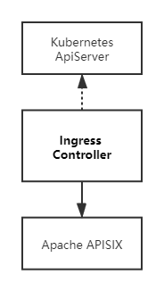

<!--
#
# Licensed to the Apache Software Foundation (ASF) under one or more
# contributor license agreements.  See the NOTICE file distributed with
# this work for additional information regarding copyright ownership.
# The ASF licenses this file to You under the Apache License, Version 2.0
# (the "License"); you may not use this file except in compliance with
# the License.  You may obtain a copy of the License at
#
#     http://www.apache.org/licenses/LICENSE-2.0
#
# Unless required by applicable law or agreed to in writing, software
# distributed under the License is distributed on an "AS IS" BASIS,
# WITHOUT WARRANTIES OR CONDITIONS OF ANY KIND, either express or implied.
# See the License for the specific language governing permissions and
# limitations under the License.
#
-->

Apache APISIX ingress for Kubernetes.

## Modules



### 1.Ingress-types

- defines the CRD(CustomResourceDefinition) needed by Apache APISIX

- currently supports ApisixRoute/ApisixUpstream，and other service and route level plugins;

- can be packaged as a stand-alone binary, keep in sync with the ingress definition;

- [CRD design](https://github.com/apache/apisix-ingress-controller/issues/3)

### 2.Types

- define interface objects to match concepts from Apache APISIX like route, service, upstream, and plugin;

- can be a packaged as a stand-alone binary, need to match with compatible Apache APISIX version;

- add new types to this module to support new features;

### 3.Seven

- contains main application logic;

- Sync the k8s cluster states to Apache APISIX, based on Apisix-types object;

### 4.Ingress-controller

- driver process for ingress controller; watches k8s apiserver;

- match and covert Apisix-ingress-types to Apisix-types before handing the control over to the above module seven;

## CRD design

Currently `apisix-ingress-controller` CRDs consist of 6 parts: ApisixRoute/ApisixUpstream/ApisixConsumer/ApisixTls/ApisixClusterConfig/ApisixPluginConfig. The design follows the following ideas.

1. The most important part of the gateway is the route part, which is used to define the distribution rules of the gateway traffics.
2. In order to facilitate understanding and configuration, the design structure of `ApisixRoute` is basically similar to Kubernetes Ingress.
3. In the design of annotation, the structure of Kubernetes Ingress is used for reference, but the internal implementation is based on the plug-in of Apache APISIX.
5. In the simplest case, you only need to define `ApisixRoute`, and the Ingress controller will automatically add `ApisixUpstream`.
7. `ApisixUpstream` can define some details on Apache APISIX upstream, such as load balancing/health check, etc.

## Monitoring CRDs

`apisix-ingress-controller` is responsible for interacting with the Kubernetes Apiserver, applying for accessible resource permissions (RBAC), monitoring changes, and implementing object conversion within the Ingress controller, comparing the changes, and then synchronizing to Apache APISIX.

### Timing diagram


* Here is a flowchart that introduces the main logic of `ApisixRoute` and other CRDs during synchronization.


### Conversion structure

`apisix-ingress-controller` provides external configuration methods for CRDs. It is aimed at operators such as daily operation and maintenance, who often need to process a large number of routes in batches, hoping to handle all related services in the same configuration file, and at the same time have convenient and understandable management capabilities. Apache APISIX is designed from the perspective of the gateway, and all routes are independent. This leads to obvious differences in the data structure between the two. One focuses on batch definition, while the other is discrete implementation.

Taking into account the usage habits of different groups of people, the data structure of CRDs draws on the data structure of Kubernetes Ingress, and is basically the same in shape.

A simple comparison is as follows, they have different definitions:


They are a many-to-many relationship.Therefore, `apisix-ingress-controller` has to do some conversion of CRDs to adapt to different gateways.

### Cascade update

At present, we have defined multiple CRDs, and these CRDs are responsible for the definition of their respective fields. `ApisixRoute`/ `ApisixUpstream` correspond to objects such as `route`/ `service` / `upstream` in Apache APISIX. As the strong binding relationship between APISIX objects, when modifying and deleting batch data structures such as CRDs, you have to consider the impact of cascading between objects.

So, in `apisix-ingress-controller`, a broadcast notification mechanism is designed through `channel`, that is, the definition of any object must be notified to other objects related to it and trigger the corresponding behavior.


**We can initiate discussions in this area and propose a more reasonable design plan**

### Diff rules

The `seven` module internally saves memory data structures, which is currently very similar to the Apache Apisix resource object. When the Kubernetes resource object is newly changed, `seven` will compare the memory objects and update incrementally according to the result of the comparison.

The current comparison rule is based on the grouping of `route` / `service` / `upstream` resource objects, compare them separately, and make corresponding broadcast notifications after finding the differences.


### Service Discovery

According to the `namespace` `name` `port` defined in the `ApisixUpstream` resource object, `apisix-ingress-controller` will register the `endpoints` node information in the `running` state to the nodes in Apache APISIX Upstream. And according to Kubernetes Endpoint status is synchronized in real time.

Based on service discovery, Apache APISIX Ingress can directly access backend Pod nodes. Bypassing Kubernetes Service, it is possible to implement customized load balancing strategies.

### Annotation implementation

Unlike the implementation of Kubernetes Nginx Ingress, the implementation of Annotation by `apisix-ingress-controller` is based on the plug-in mechanism of Apache APISIX.

For example, the settings of the black and white list can be configured through the `k8s.apisix.apache.org/whitelist-source-range` annotation in the `ApisixRoute` resource object.

```yaml
apiVersion: apisix.apache.org/v2
kind: ApisixRoute
metadata:
  annotations:
    k8s.apisix.apache.org/whitelist-source-range: 1.2.3.4,2.2.0.0/16
  name: httpserver-route
spec:
    ...
```

The black and white list here is implemented by the [ip-restriction](https://github.com/apache/apisix/blob/master/docs/en/latest/plugins/ip-restriction.md) plugin.

There will be more annotation implementations in the future to facilitate the definition of some common configurations, such as CORS.

If you have some annotation needs, welcome to [issue](https://github.com/apache/apisix-ingress-controller/issues) to discuss, let’s discuss how to implement it.
