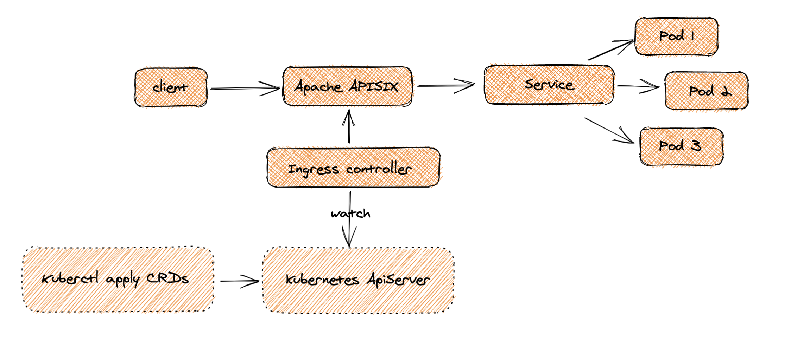

<!--
#
# Licensed to the Apache Software Foundation (ASF) under one or more
# contributor license agreements.  See the NOTICE file distributed with
# this work for additional information regarding copyright ownership.
# The ASF licenses this file to You under the Apache License, Version 2.0
# (the "License"); you may not use this file except in compliance with
# the License.  You may obtain a copy of the License at
#
#     http://www.apache.org/licenses/LICENSE-2.0
#
# Unless required by applicable law or agreed to in writing, software
# distributed under the License is distributed on an "AS IS" BASIS,
# WITHOUT WARRANTIES OR CONDITIONS OF ANY KIND, either express or implied.
# See the License for the specific language governing permissions and
# limitations under the License.
#
-->

## What is apisix-ingress-controller

apisix-ingress-controller is yet another Ingress controller for Kubernetes using [Apache APISIX](https://apisix.apache.org) as the high performance reverse proxy.

It's configured by using the declarative configurations like [ApisixRoute](./concepts/apisix_route.md), [ApisixUpstream](./concepts/apisix_upstream.md), [Ingress](https://kubernetes.io/docs/concepts/services-networking/ingress/).
All these resources are watched and converted to corresponding resources in Apache APISIX.

Service Discovery are also supported through [Kubernetes Service](https://kubernetes.io/docs/concepts/services-networking/service/),
and will be reflected to nodes in APISIX Upstream.

## Features

* Declarative configuration
* Full dynamic capabilities to delivery configurations.
* Native Kubernetes Ingress (both v1 and v1beta1) support.
* Service Discovery based on Kubernetes Service.
* Out of box support for node health check.
* Support load balancing based on Pod (upstream nodes).
* Rich plugins support.
* Easy to deploy and use.

## How It Works

See [Design](./design.md) for more details.

## Installation on Cloud

apisix-ingress-controller supports to be installed on some clouds such as AWS, GCP.

* [Install Ingress APISIX on Azure AKS](https://apisix.apache.org/docs/ingress-controller/deployments/azure)
* [Install Ingress APISIX on AWS EKS](https://apisix.apache.org/docs/ingress-controller/deployments/aws)
* [Install Ingress APISIX on ACK](https://apisix.apache.org/docs/ingress-controller/deployments/ack)
* [Install Ingress APISIX on Google Cloud GKE](https://apisix.apache.org/docs/ingress-controller/deployments/gke)
* [Install Ingress APISIX on Minikube](https://apisix.apache.org/docs/ingress-controller/deployments/minikube)
* [Install Ingress APISIX on KubeSphere](https://apisix.apache.org/docs/ingress-controller/deployments/kubesphere)
* [Install Ingress APISIX on K3S and RKE](https://apisix.apache.org/docs/ingress-controller/deployments/k3s-rke)

## Installation on Prem

If you want to deploy apisix-ingress-controller on Prem, we recommend you to use [Helm](https://helm.sh/). Just a few steps

## Get Involved to Contribute

First, your supports and cooperations to make this project better are appreciated.
But before you start, please read [How to Contribute](./contribute.md) and [How to Develop](./development.md).

## Compatibility with Apache APISIX

The following table describes the compatibility between apisix-ingress-controller and
[Apache APISIX](https://apisix.apache.org).

| apisix-ingress-controller | Apache APISIX |
| ----:| ---:|
| `master` | `>= 2.4`, `2.5` is recommended. |
| `0.6` | `>= 2.6`, `2.6` is recommended. |
| `0.5` | `>= 2.4`, `2.5` is recommended. |
| `0.4` |`>= 2.4`|
