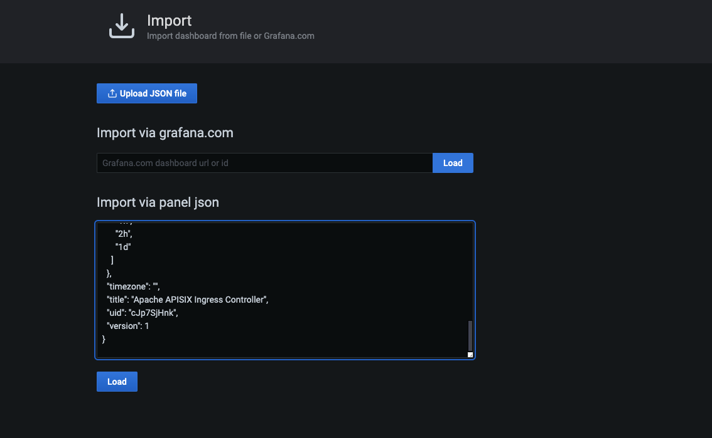

<!--
#
# Licensed to the Apache Software Foundation (ASF) under one or more
# contributor license agreements.  See the NOTICE file distributed with
# this work for additional information regarding copyright ownership.
# The ASF licenses this file to You under the Apache License, Version 2.0
# (the "License"); you may not use this file except in compliance with
# the License.  You may obtain a copy of the License at
#
#     http://www.apache.org/licenses/LICENSE-2.0
#
# Unless required by applicable law or agreed to in writing, software
# distributed under the License is distributed on an "AS IS" BASIS,
# WITHOUT WARRANTIES OR CONDITIONS OF ANY KIND, either express or implied.
# See the License for the specific language governing permissions and
# limitations under the License.
#
-->

This guide shows how to monitor Apache APISIX Ingress Controller using Prometheus and Grafana.

## Enable Prometheus

You can find example CRD files in `apisix-ingress-controller/samples/deploy/crd/v1`.  
The CRD file `ApisixClusterConfig` is required to use to enable prometheus in global configurations.  
In `ApisixClusterConfig`, `monitoring.prometheus` field is used to describe Prometheus settings.
```yaml
...
monitoring:
  type: object
  properties:
    prometheus:
      type: object
      properties:
        enable:
          type: boolean
...
```
Now apply `ApisixClusterConfig` by:
```
cd apisix-ingress-controller/samples/deploy/crd/v1
kubectl apply -f ApisixClusterConfig.yaml 
```
## Configure Prometheus Server

The Prometheus server address should be `127.0.0.1:9090` by default. You can set the target url for `apisix-ingress-controller` manually in `prometheus.yml`. 
For example:
```yaml
...
scrape_configs:
  - job_name: "apisix-ingress-controller"
    static_configs:
    - targets: ["localhost:9092"]
```
According to the above example, the metrics are exposed in `http://localhost:9092/metrics` now.  
Visit `http://localhost:9090` in your browser, and select `apisix-ingress-controller` in `targets`
or visit `http://localhost:9092/metrics` to see the data.

## Grafana Dashboard

Grafana dashboard shows the metrics exposed in Prometheus graphically.  
[Installing Grafana](https://grafana.com/docs/grafana/latest/#installing-grafana)  
Visit `http://localhost:3000/` in your browser to access Grafana. The default username and password are `admin`.  
Then create a new dashboard for `apisix-ingress-controller`.  
  
Follow the steps to apply the configuration of Grafana Dashboard for `apisix-ingress-controller`.  
- Add an empty panel, and import via panel json in `apisix-ingress-controller/docs/assets/other/json/apisix-ingress-controller-grafana.json`.


- Select `Prometheus database` as the datasource. Set the URL according to your Prometheus server configuration.  


### Preview


## Available metrics
- `Is leader`: A gauge type metric with value 0 or 1, indicates whether the role of controller instance is leader, for leader is 1 and candidate is 0.  
Labels:
  - controller_pod
  - controller_namespace
- `Status codes`: status codes of requests to APISIX.  
Labels:
  - controller_pod
  - controller_namespace
  - status_code: the HTTP status code returned by APISIX.  
  - resource
- `Latency`: Request latencies with APISIX.  
Labels:
  - controller_pod
  - controller_namespace
- `Requests`: Number of requests to APISIX.  
Labels:
  - controller_pod
  - controller_namespace
  - resource
- `Check cluster health`: Number of cluster health check operations.  
Labels:
  - controller_pod
  - controller_namespace
  - name: cluster name.
- `Sync operation`: Number of sync operations.  
Labels:
  - controller_pod
  - controller_namespace
  - resource
  - result: sync success or failure.
- `Cache sync`: Number of cache sync operations.  
Labels:
  - controller_pod
  - controller_namespace
  - result: sync success or failure.
- `Controller events`: Number of events handled by the controller.  
Labels:
  - controller_pod
  - controller_namespace
  - resource
  - operation: includes `add`, `update`, `delete`.