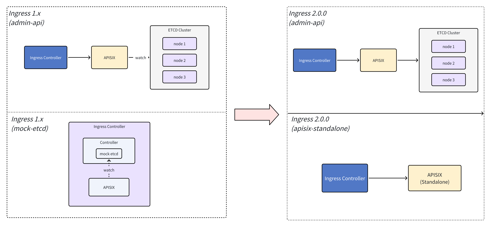

<!--
#
# Licensed to the Apache Software Foundation (ASF) under one or more
# contributor license agreements.  See the NOTICE file distributed with
# this work for additional information regarding copyright ownership.
# The ASF licenses this file to You under the Apache License, Version 2.0
# (the "License"); you may not use this file except in compliance with
# the License.  You may obtain a copy of the License at
#
#     http://www.apache.org/licenses/LICENSE-2.0
#
# Unless required by applicable law or agreed to in writing, software
# distributed under the License is distributed on an "AS IS" BASIS,
# WITHOUT WARRANTIES OR CONDITIONS OF ANY KIND, either express or implied.
# See the License for the specific language governing permissions and
# limitations under the License.
#
-->

## Upgrading from 1.x.x to 2.0.0: Key Changes and Considerations

This document outlines the major updates, configuration compatibility changes, API behavior differences, and critical considerations when upgrading the APISIX Ingress Controller from version 1.x.x to 2.0.0. Please read carefully and assess the impact on your existing system before proceeding with the upgrade.

### APISIX Version Dependency (Data Plane)

The `apisix-standalone` mode is supported only with **APISIX 3.13.0**. When using this mode, it is mandatory to upgrade the data plane APISIX instance along with the Ingress Controller.

### Architecture Changes

#### Architecture in 1.x.x

There were two main deployment architectures in 1.x.x:

| Mode           | Description                                                                            | Issue                                                                          |
| -------------- | -------------------------------------------------------------------------------------- | ------------------------------------------------------------------------------ |
| Admin API Mode | Runs a separate etcd instance, with APISIX Admin API managing data plane configuration | Complex to deploy; high maintenance overhead for etcd                          |
| Mock-ETCD Mode | APISIX and the Ingress Controller are deployed in the same Pod, mocking etcd endpoints | Stateless Ingress cannot persist revision info; may lead to data inconsistency |

#### Architecture in 2.0.0



##### Mock-ETCD Mode Deprecated

The mock-etcd architecture is no longer supported. This mode introduced significant reliability issues: stateless ingress controllers could not persist revision metadata, leading to memory pollution in the data plane and data inconsistencies.

The following configuration block has been removed:

```yaml
etcdserver:
  enabled: false
  listen_address: ":12379"
  prefix: /apisix
  ssl_key_encrypt_salt: edd1c9f0985e76a2
```

##### Controller-Only Configuration Source

Starting with APISIX Ingress Controller 2.0.0, the controller is the single source of truth. Manual Admin API changes will be overwritten on the next full sync. The prior approach, which allowed controller-managed and manually added configurations to coexist, was incorrect and is now deprecated.

#### APISIX With Etcd (Admin API) synchronization performance

In APISIX Ingress Controller 2.0.0, ADC performs scheduled resource synchronization by comparing resources against the admin API response.

Because the Admin API fills in default values, the submitted content may differ from the returned result. This breaks the diff, triggering full updates to data plane resources, causing cache invalidation and significant performance impact.

### Ingress Configuration Changes

#### Configuration Path Changes

| Old Path                 | New Path             |
| ------------------------ | -------------------- |
| `kubernetes.election_id` | `leader_election_id` |

#### Removed Configuration Fields

| Configuration Path   | Description                              |
| -------------------- | ---------------------------------------- |
| `kubernetes.*`       | Multi-namespace control / sync interval  |
| `plugin_metadata_cm` | Plugin metadata ConfigMap                |
| `log_rotation_*`     | Log rotation settings                    |
| `apisix.*`           | Static Admin API configuration           |
| `etcdserver.*`       | Configuration for mock-etcd (deprecated) |

#### Example: Legacy Configuration Removed in 2.0.0

```yaml
apisix:
  admin_api_version: v3
  default_cluster_base_url: "http://127.0.0.1:9180/apisix/admin"
  default_cluster_admin_key: ""
  default_cluster_name: "default"
```

#### New Configuration via `GatewayProxy` CRD

From version 2.0.0, the data plane must be connected via the `GatewayProxy` CRD:

```yaml
apiVersion: networking.k8s.io/v1
kind: IngressClass
metadata:
  namespace: ingress-apisix
  name: apisix
spec:
  controller: "apisix.apache.org/apisix-ingress-controller"
  parameters:
    apiGroup: "apisix.apache.org"
    kind: "GatewayProxy"
    name: "apisix-proxy-config"
    namespace: "default"
    scope: "Namespace"
---
apiVersion: apisix.apache.org/v1alpha1
kind: GatewayProxy
metadata:
  namespace: ingress-apisix
  name: apisix-proxy-config
spec:
  provider:
    type: ControlPlane
    controlPlane:
      endpoints:
      - https://127.0.0.1:9180
      auth:
        type: AdminKey
        adminKey:
          value: ""
```

### API Changes

#### `ApisixUpstream`

Due to current limitations in the [ADC](https://github.com/api7/adc) component, the following fields are not yet supported:

* `spec.discovery`: Service Discovery
* `spec.healthCheck`: Health Checking

More details: [ADC Backend Differences](https://github.com/api7/adc/blob/2449ca81e3c61169f8c1e59efb4c1173a766bce2/libs/backend-apisix-standalone/README.md#differences-in-upstream)

#### `ApisixClusterConfig`

The `ApisixClusterConfig` CRD has been removed in 2.0.0. global rules and configurations should now be managed through the `ApisixGlobalRule` CRDs.

#### `ApisixConsumer` - `hmac-auth`

In apisix >= 3.11, most of the hmac-auth related configuration has been deprecated from consumer and moved to service/route level. The name of a `required` field has also been changed from `access_key` to `key_id`. If you have ApisixConsumer configuration with hmac-auth plugin compatible with <3.11, they will not be compatible with newer versions of APISIX. Since all 3+ versions of apisix are supported by ingress controller, if you dont upgrade APISIX, you don't need to change your ApisixConsumer configuration. But when using >3.11, pass all configurations other than `key_id`(previously `access_key`) via PluginConfig or ApisixRoute.

#### Ingress

##### API Version Support

Currently supports networking.k8s.io/v1 only. Support for other Ingress API versions (networking.k8s.io/v1beta1 and extensions/v1beta1) is not yet available in 2.0.0.

##### Limited Support for Ingress Annotations

Ingress annotations used in version 1.x.x are not fully supported in 2.0.0. If your existing setup relies on any of the following annotations, validate compatibility or consider delaying the upgrade.

| Ingress Annotations                                    |
| ------------------------------------------------------ |
| `k8s.apisix.apache.org/use-regex`                      |
| `k8s.apisix.apache.org/enable-websocket`               |
| `k8s.apisix.apache.org/plugin-config-name`             |
| `k8s.apisix.apache.org/upstream-scheme`                |
| `k8s.apisix.apache.org/upstream-retries`               |
| `k8s.apisix.apache.org/upstream-connect-timeout`       |
| `k8s.apisix.apache.org/upstream-read-timeout`          |
| `k8s.apisix.apache.org/upstream-send-timeout`          |
| `k8s.apisix.apache.org/enable-cors`                    |
| `k8s.apisix.apache.org/cors-allow-origin`              |
| `k8s.apisix.apache.org/cors-allow-headers`             |
| `k8s.apisix.apache.org/cors-allow-methods`             |
| `k8s.apisix.apache.org/enable-csrf`                    |
| `k8s.apisix.apache.org/csrf-key`                       |
| `k8s.apisix.apache.org/http-to-https`                  |
| `k8s.apisix.apache.org/http-redirect`                  |
| `k8s.apisix.apache.org/http-redirect-code`             |
| `k8s.apisix.apache.org/rewrite-target`                 |
| `k8s.apisix.apache.org/rewrite-target-regex`           |
| `k8s.apisix.apache.org/rewrite-target-regex-template`  |
| `k8s.apisix.apache.org/enable-response-rewrite`        |
| `k8s.apisix.apache.org/response-rewrite-status-code`   |
| `k8s.apisix.apache.org/response-rewrite-body`          |
| `k8s.apisix.apache.org/response-rewrite-body-base64`   |
| `k8s.apisix.apache.org/response-rewrite-add-header`    |
| `k8s.apisix.apache.org/response-rewrite-set-header`    |
| `k8s.apisix.apache.org/response-rewrite-remove-header` |
| `k8s.apisix.apache.org/auth-uri`                       |
| `k8s.apisix.apache.org/auth-ssl-verify`                |
| `k8s.apisix.apache.org/auth-request-headers`           |
| `k8s.apisix.apache.org/auth-upstream-headers`          |
| `k8s.apisix.apache.org/auth-client-headers`            |
| `k8s.apisix.apache.org/allowlist-source-range`         |
| `k8s.apisix.apache.org/blocklist-source-range`         |
| `k8s.apisix.apache.org/http-allow-methods`             |
| `k8s.apisix.apache.org/http-block-methods`             |
| `k8s.apisix.apache.org/auth-type`                      |
| `k8s.apisix.apache.org/svc-namespace`                  |

### Summary

| Category         | Description                                                                                                                       |
| ---------------- | --------------------------------------------------------------------------------------------------------------------------------- |
| Architecture     | The `mock-etcd` component has been removed. Configuration is now centralized through the Controller.                              |
| Configuration    | Static configuration fields have been removed. Use `GatewayProxy` CRD to configure the data plane.                                |
| Data Plane       | The Admin API configuration method is still supported. Support for the Standalone API-driven mode was introduced in APISIX 3.13.0 and later. |
| API              | Some fields in `Ingress Annotations` and `ApisixUpstream` are not yet supported.                                                  |
| Upgrade Strategy | Blue-green deployment or canary release is recommended before full switchover.                                                    |
