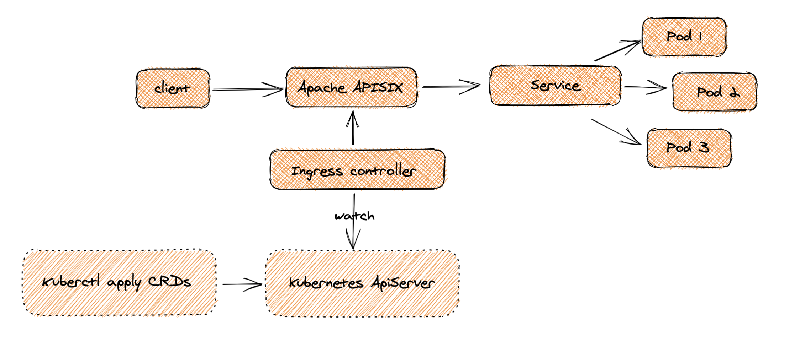
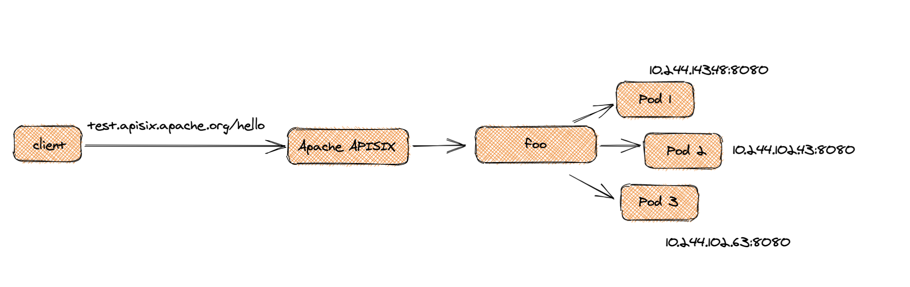

<!--
#
# Licensed to the Apache Software Foundation (ASF) under one or more
# contributor license agreements.  See the NOTICE file distributed with
# this work for additional information regarding copyright ownership.
# The ASF licenses this file to You under the Apache License, Version 2.0
# (the "License"); you may not use this file except in compliance with
# the License.  You may obtain a copy of the License at
#
#     http://www.apache.org/licenses/LICENSE-2.0
#
# Unless required by applicable law or agreed to in writing, software
# distributed under the License is distributed on an "AS IS" BASIS,
# WITHOUT WARRANTIES OR CONDITIONS OF ANY KIND, either express or implied.
# See the License for the specific language governing permissions and
# limitations under the License.
#
-->

# Usage of Ingress controller

In this article, we will use ingress controller CRDs (CustomResourceDefinition) to define routing rules against the admin api of Apache APISIX.

## Scenes

Configure a simple routing rule through the ingress controller CRDs. After synchronizing to the gateway, the data traffic is accessed to the back-end service through Apache APISIX. Then, we gradually add or remove plug-ins to the routing to achieve functional expansion.

As shown below.



## A simple example

Define the simplest route to direct traffic to the back-end service, the back-end service is named `httpserver`.

As shown below.(The ip list in nodes is an example, no specific meaning)



Now we define with CRDs as follows.

1. Define Upstream with `ApisixUpstream`

```yaml
apiVersion: apisix.apache.org/v1
kind: ApisixUpstream
metadata:
  name: foo
spec:
  ports:
  - port: 8080
    loadbalancer:
      type: chash
      hashOn: header
      key: hello
```

2. Define Route with `ApisixRoute`

```yaml
apiVersion: apisix.apache.org/v1
kind: ApisixRoute
metadata:
  name: foo-route
spec:
  rules:
  - host: test.apisix.apache.org
    http:
      paths:
      - backend:
          serviceName: foo
          servicePort: 8080
        path: /hello*
```

Tips: When defining `ApisixUpstream`, there is no need to define a specific pod ip list, the ingress controller will do service discovery based on namespace/name/port composite index.

List the way to define the above rules using `Admin API` to facilitate comparison and understanding.

```shell
# 1. Define upstream: foo-upstream id=1 (the ip list in nodes is an example, no specific meaning)
curl -XPUT http://127.0.0.1:9080/apisix/admin/upstreams/1 -H 'X-API-KEY: edd1c9f034335f136f87ad84b625c8f1' -d '
{
    "nodes": {
        "10.244.143.48:8080": 100,
        "10.244.102.43:8080": 100,
        "10.244.102.63:8080": 100
    },
    "desc": "foo-upstream",
    "type": "roundrobin"
}
'
# 2. Define service: foo-service, id=2, binding upstream: foo-upstream
curl -XPUT http://127.0.0.1:9080/apisix/admin/services/2 -H 'X-API-KEY: edd1c9f034335f136f87ad84b625c8f1' -d '
{
    "desc": "foo-service",
    "upstream_id": 1
}
'

# 3. Define route: foo-route， id=3， binding service: foo-service

curl -XPUT http://127.0.0.1:9080/apisix/admin/routes/3 -H 'X-API-KEY: edd1c9f034335f136f87ad84b625c8f1' -d '
{
    "desc": "foo-route",
    "uri": "/hello*",
    "host": "test.apisix.apache.org",
    "service_id": "2"
}'
```

