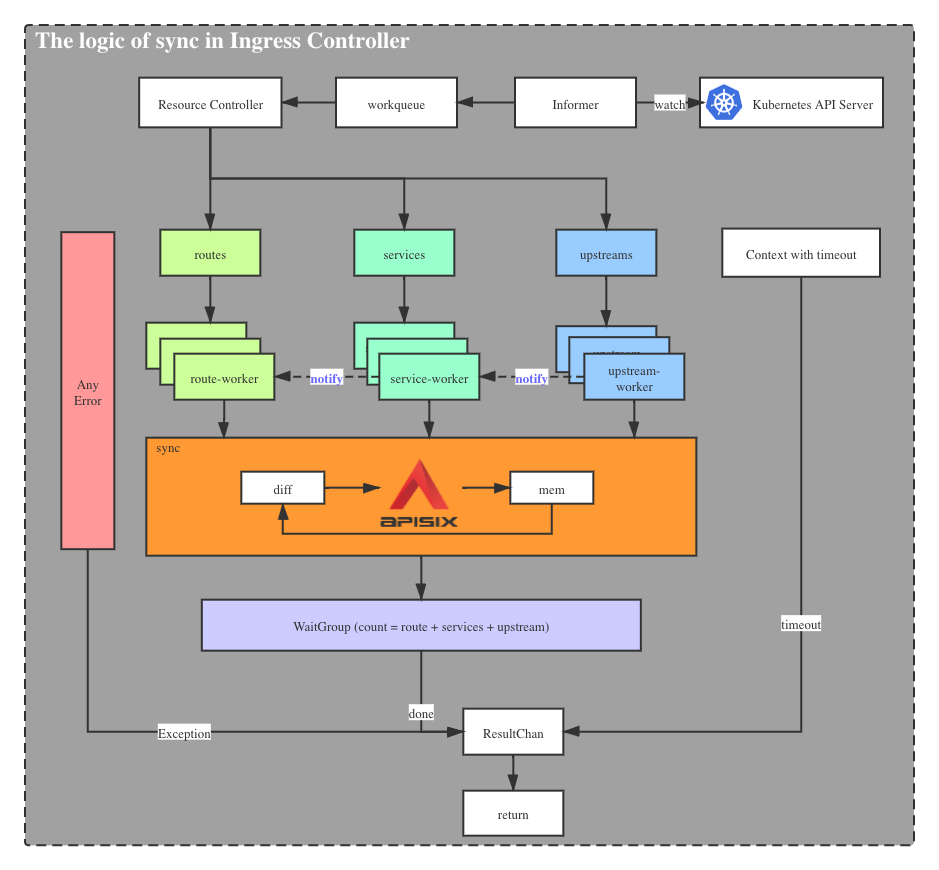
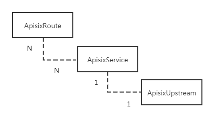

<!--
#
# Licensed to the Apache Software Foundation (ASF) under one or more
# contributor license agreements.  See the NOTICE file distributed with
# this work for additional information regarding copyright ownership.
# The ASF licenses this file to You under the Apache License, Version 2.0
# (the "License"); you may not use this file except in compliance with
# the License.  You may obtain a copy of the License at
#
#     http://www.apache.org/licenses/LICENSE-2.0
#
# Unless required by applicable law or agreed to in writing, software
# distributed under the License is distributed on an "AS IS" BASIS,
# WITHOUT WARRANTIES OR CONDITIONS OF ANY KIND, either express or implied.
# See the License for the specific language governing permissions and
# limitations under the License.
#
-->

Apache APISIX ingress for Kubernetes.

## 模块


### 1.Ingress-types 模块

- 定义 Apache APISIX 所需的 CRD（CustomResourceDefinition）

- 目前支持 ApisixRoute / ApisixUpstream，和其他服务跟路由级别的插件;

- 可打包为独立二进制文件，与 ingress 定义保持同步；

- [CRD 的设计](https://github.com/apache/apisix-ingress-controller/issues/3)

### 2.Types 模块

- 定义接口对象以匹配 Apache APISIX 的一些概念，如 route, service, upstream, and plugin;

- 打包成独立的二进制文件, 需要适配 Apache APISIX 的版本;

- 增加模块新的 types 以支持新的特性;

### 3.Seven 模块

- 包含主程序逻辑;

- 基于Apisix-types对象将k8s集群的状态同步到Apache APISIX;

### 4.Ingress-controller 模块

- ingress controller 的驱动程序; 观察 k8s apiserver;

- 在将控制权移交给 seven 模块之前， 将 Apisix-ingress-types 与 Apisix-types 对象进行匹配和转换;

## CRD 的设计

当前 `apisix-ingress-controller` CRDs 包括3个部分: ApisixRoute / ApisixUpstream / ApisixTls. 设计遵循以下思路.

1. 网关最重要的部分是路由部分，用来定义网关业务的分发规则.
2. 为了便于理解和配置，`ApisixRoute` 的设计结构与 Kubernetes Ingress 基本相似.
3. annotation 的设计，借鉴了 Kubernetes Ingress 的结构，但内部实现是基于 Apache APISIX 插件的.
4. 在最简单的情况下，您只需要定义 `ApisixRoute` ， Ingress controller 就会自动添加 `ApisixUpstream`
5. `ApisixUpstream` 可以定义 Apache APISIX upstream 的一些细节，比如负载平衡/健康检查 等。

## 监控 CRDs

`apisix-ingress-controller` 负责与 Kubernetes Apiserver 交互，申请可访问资源权限（RBAC），监视变更，并在 Ingress controller 内实现对象转换，对比变更点，然后同步给 Apache APISIX。

### 时序图


* 下面是一个流程图，介绍了在同步期间 `ApisixRoute` 和其他 CRDs 的主要逻辑。



### 转换结构

`apisix-ingress-controller` 提供 CRDs 的外部配置方法。针对日常操作和维护，往往需要批量处理大量路由，希望在同一配置文件中处理所有相关业务，同时具有方便易懂的管理功能。 Apache APISIX 是从网关的角度设计的， 所有路由都是独立的。 这导致了两者在数据结构上的明显差异。一个是批量定义，另一个是离散实现。

考虑到不同人群的使用习惯，CRDs 的数据结构借鉴了 Kubernetes Ingress 的数据结构，形状基本相同。

下面是简单的比较，他们有不同的的定义:


他们是一对多关系。因此，`apisix-ingress-controller` 必须对 CRDs 进行一些转换， 以适应不同的网关。

### 级联更新

目前， 我们已经定义了多个 CRD ，这些 CRD 负责各自字段的定义。 `ApisixRoute` / `ApisixUpstream` 对应于 Apache APISIX 中的 `route` / `service` / `upstream` 等对象。由于 APISIX 对象之间的强绑定关系，在修改和删除 CRD 等批处理数据结构时， 必须考虑对象间级联的影响。

因此，在 `apisix-ingress-controller` 中 ，通过 `channel` 设计了一种广播通知机制，即任何对象的定义都必须通知给与其相关的其他对象并触发相应的行为。



**我们可以就此展开讨论，提出更合理的设计方案**

### 规则之间的差异

 `seven` 模块在内部保存内存数据结构，这与 Apache Apisix 资源对象非常相似。 当 Kubernetes 资源对象被新更改时，`seven` 将比较内存对象，并根据比较结果进行增量更新。

 当前的比较规则是基于 `route` / `service` / `upstream` 资源对象的分组， 分别进行比较， 发现差异后进行相应的广播通知。


### 服务发现

根据 `ApisixUpstream` 资源对象中定义的 `namespace` `name` `port` ，`apisix-ingress-controller` 将 `running` 状态下的 `endpoints` 节点信息注册到 Apache APISIX Upstream 中的节点。并根据 Kubernetes 算法对端点状态进行实时同步。

基于服务发现，Apache APISIX Ingress 可以绕过 Kubernetes Service 直接访问后端 Pod 节点。并可以定制的负载平衡策略。

### Annotation 的实现

与 Kubernetes Nginx Ingress 的实现不同，`apisix-ingress-controller` 的 Annotation 实现基于 Apache APISIX 的插件机制。

例如，黑名单和白名单的设置可以通过 `ApisixRoute` 资源对象中annotation 的 `k8s.apisix.apache.org/whitelist-source-range` 项目来配置。

```yaml
apiVersion: apisix.apache.org/v1
kind: ApisixRoute
metadata:
  annotations:
    k8s.apisix.apache.org/whitelist-source-range: 1.2.3.4,2.2.0.0/16
  name: httpserver-route
spec:
    ...
```

黑白名单的实现逻辑是在 [ip-restriction](https://github.com/apache/apisix/blob/master/doc/plugins/ip-restriction.md) 插件里.

将来会有更多的 annotation 实现来简化一些常见配置的定义，比如 CORS。

如果你有更多的 annotation 需求， 欢迎来 [issue](https://github.com/apache/apisix-ingress-controller/issues) 讨论，让我们一起来探讨如何实现。
