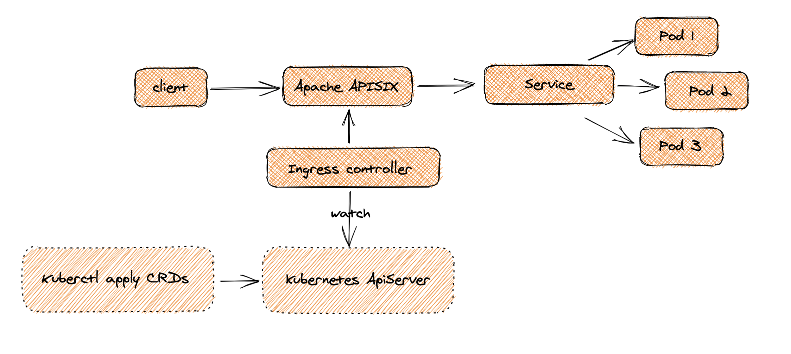

<!--
#
# Licensed to the Apache Software Foundation (ASF) under one or more
# contributor license agreements.  See the NOTICE file distributed with
# this work for additional information regarding copyright ownership.
# The ASF licenses this file to You under the Apache License, Version 2.0
# (the "License"); you may not use this file except in compliance with
# the License.  You may obtain a copy of the License at
#
#     http://www.apache.org/licenses/LICENSE-2.0
#
# Unless required by applicable law or agreed to in writing, software
# distributed under the License is distributed on an "AS IS" BASIS,
# WITHOUT WARRANTIES OR CONDITIONS OF ANY KIND, either express or implied.
# See the License for the specific language governing permissions and
# limitations under the License.
#
-->

## apisix-ingress-controller是什么

apisix-ingress-controller 是方便 Kubernetes 使用 [Apache APISIX](https://apisix.apache.org) 作为高性能反向代理的一款 Ingress 控制器。

可以用声明式的配置项如 [ApisixRoute](./concepts/apisix_route.md), [ApisixUpstream](./concepts/apisix), [Ingress](https://kubernetes.io/docs/concepts/services-networking/ingress/) 来进行配置。
所有的这些资源都可以被 Apache APISIX 感知到并做对应的资源转换。

通过 [Kubernetes Service](https://kubernetes.io/docs/concepts/services-networking/service/) 它也支持服务发现, 并映射到 APISIX Upstream 对应的节点上。

## 特性

* 声明性配置
* 全动态功能配制
* 原生 Kubernetes Ingress 支持（兼顾 v1 和 v1beta1）
* 基于 Kubernetes Service 的服务发现
* 开箱即用支持 node 健康检查
* 支持基于pod（上游nodes）的负载均衡
* 丰富的插件支持
* 容易部署和使用

## 工作机制

详见 [Design](./design.md) 。

## 云上的安装

apisix-ingress-controller 支持如下云上的安装：

* [Azure AKS](./docs/en/latest/deployments/azure.md)
* [AWS EKS](./docs/en/latest/deployments/aws.md)
* [ACK](./docs/en/latest/deployments/ack.md)
* [Google Cloud GKE](./docs/en/latest/deployments/gke.md)
* [Minikube](./docs/en/latest/deployments/minikube.md)
* [KubeSphere](./docs/en/latest/deployments/kubesphere.md)
* [K3S and RKE](./docs/en/latest/deployments/k3s-rke.md)

## 在 Prem 上安装

如果想在 Prem 上安装 apisix-ingress-controller , 建议你使用 [Helm](https://helm.io) 。 简单的几步就能完成安装。

## 参与贡献

首先我们感谢您对项目的支持和合作，因为这样，项目会变得更好。但在开始之前，请先读一读 [如何参与贡献](./contribute.md) 和 [如何开发项目](./development.md).
